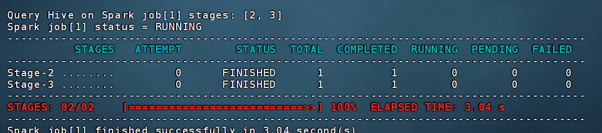
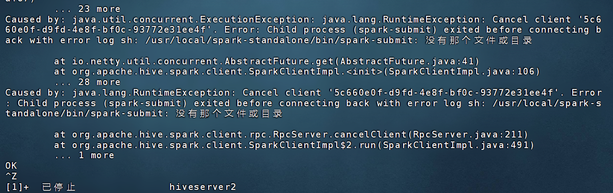
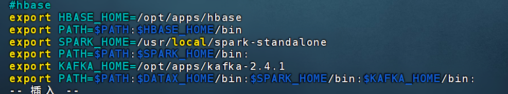
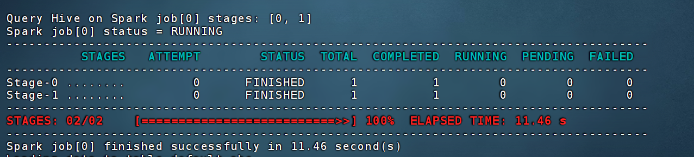

情况如下：

本来hive on spark是正常的状态，增删改查都没有问题，直到一天虚拟机因为笔记本非正常关机后重启完虚拟机仍在工作，

然后在关闭集群时，node02，03正常关闭，node01死活关闭不了（关闭虚拟机后再次打开node01还是运行状态），直接任务管理器强退相关任务和服务后才关闭，最后导致metastore数据库异常，hive执行插入操作异常，报错：

`[2024-10-05 18:28:26] [42000][30041] Error while processing statement: FAILED: Execution Error, return code 30041 from org.apache.hadoop.hive.ql.exec.spark.SparkTask. Failed to create Spark client for Spark session d8f9be8d-27ba-464b-af51-94b5e3275c47`

解决方法:

~~删除metastore重新创建并初始化元数据库:~~

~~`mysql> drop database metastore;`~~

~~`mysql> create database metastore;`~~

~~`[root@node01 conf]$ schematool -initSchema -dbType mysql -verbose`~~

~~然后重启hive和集群执行插入数据测试：~~

~~~~

~~成功~~

十几分钟后再次使用又遇到同样的报错，

然后发现spark用的是大学上课装的老版本，而我的/etc/profile配置文件里是这样的：

（即使/etc/profile.d里配置的SPARK_HOME是正确的路径）

删除老版本Spark再修改profile文件Spark_home位置后，Hive on Spark再次复活。

